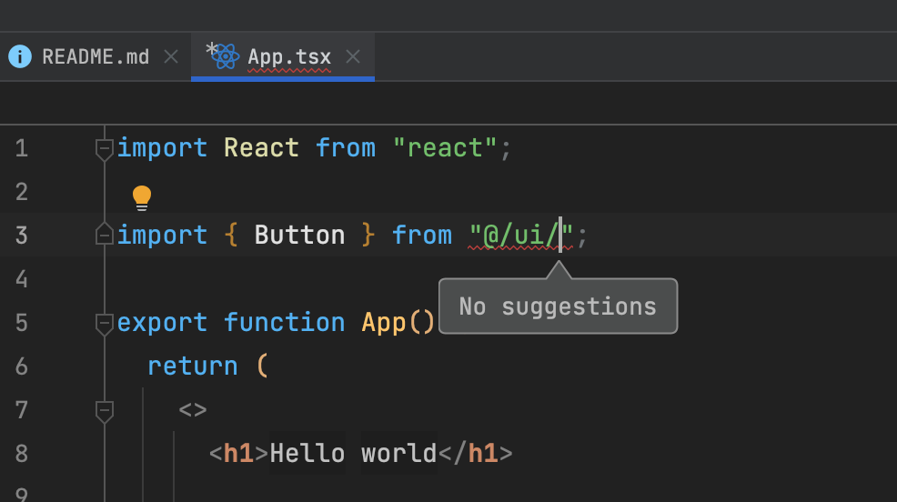
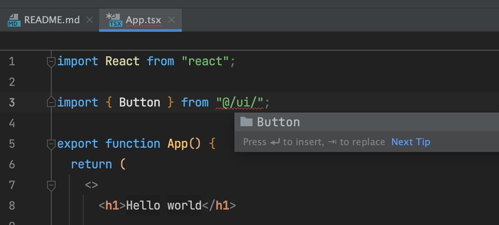

# About
This repo reproduces bug in webstorm 2021.3 when there is no completion in import paths

#### Steps to reproduce:
- Install npm deps
- Open project in webstorm 2021.3 beta (or 2021.2)
- In file src/App.tsx point cursor on line 3:30 
- Invoke basic code completion action

#### Actual result:

"No suggestions" in completion popup

#### Excepted result:

List of subfolders

#### Notes

I have tested it on mac and windows, same problems. 

Also note that on clean install (no caches, no .idea folder etc), folders completion works for some time, but after a while bug appears again even on older IDE versions

# Install
    npm i

### Run
    npm dev
